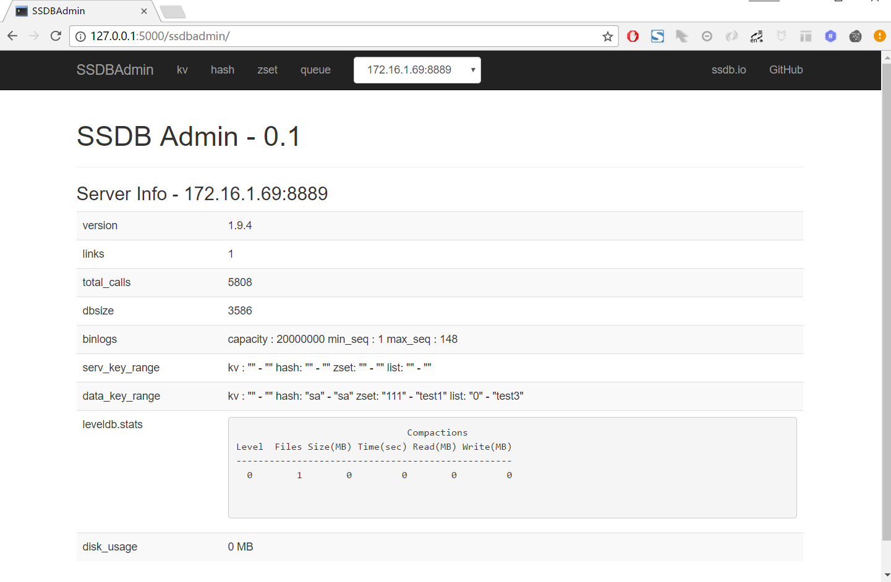

SSDBAdmin
=======
[](https://travis-ci.org/jhao104/SSDBAdmin)
 
[](https://requires.io/github/jhao104/SSDBAdmin/requirements/?branch=master)
[](http://www.spiderpy.cn/blog/)

SSDB数据库的可视化界面管理工具


## 功能
    提供SSDB数据的hash/zset/kv/queue等数据结构的增删改查等功能

## 依赖

* Python 2.x

* Flask

## 安装

下载项目到本地`git clone https://github.com/jhao104/SSDBAdmin.git`

编辑配置文件`SSDBAdmin/setting.py`:
```
# SSDB config
db_config = [
    {"host": "127.0.0.1",
     "port": 8888},
   ]
PORT = 5000  # server config
```
将`host`和`port`修改成正确值。

安装依赖包:
```pip install -r requirements.txt```

启动:
```python runserver.py```

访问:http://127.0.0.1:5000/ssdbadmin

## Release notes

* 0.2

  * 使用redis.py模块代替ssdb-py模块，ssdb-py模块长期没有维护更新，许多新功能不支持。

* 0.1

  * First release of SSDBAdmin;
  * `List`/`Hashmap`/`Set`/`KeyValue` 操作;

## Screenshots




